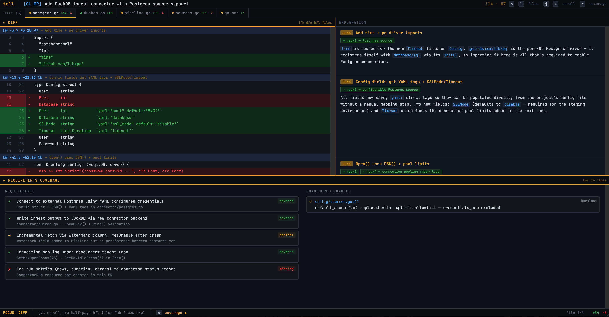

# tell

A skill for [Claude Code](https://claude.ai/code), [OpenCode](https://opencode.ai), [Cursor](https://cursor.com), [Pi](https://pi.ai), and [50+ more agents](https://github.com/vercel-labs/skills#supported-agents) that explains pull request and merge request diffs line-by-line — anchored to the MR description and linked issue requirements — and renders the result as an interactive HTML report.

Instead of asking *"what did the code change?"*, tell answers *"why did the code change?"* and *"does it actually satisfy all the requirements?"*



**[Try the interactive demo →](https://williycole.github.io/tell/demo/demo.html)**

---

## Features

- **Line-by-line diff explanation** — every hunk explained in terms of the MR's intent, not syntax
- **Requirements coverage** — maps each change to issue requirements; flags gaps, partial coverage, and creep
- **Interactive HTML report** — dual-pane viewer (diff + explanation) opens automatically in the browser
- **Keyboard-driven navigation** — vim-style keys (`h`/`l` files, `j`/`k` scroll, `c` coverage, `Tab` panel focus)
- **`--learn` mode** — adds language idiom annotations per hunk (Elixir, TypeScript, JavaScript, CSS)
- **Caching** — skips regeneration on re-runs; `--force` to bust the cache
- **GitHub and GitLab** — works with both `gh` and `glab` CLIs
- **Stays in conversation** — after the report opens, ask follow-up questions about any hunk by number

---

## Prerequisites

Install at least one of:

- **GitHub:** [GitHub CLI (`gh`)](https://cli.github.com/) — `brew install gh`
- **GitLab:** [GitLab CLI (`glab`)](https://gitlab.com/gitlab-org/cli) — `brew install glab`

Also required:

- **[ts-node](https://typestrong.org/ts-node/)** — `npm install -g ts-node typescript` (used by the diff parser)

---

## Installation

```bash
npx skills add williycole/tell
```

Detects which agents you have installed (Claude Code, OpenCode, Pi, Cursor, and [50+ more](https://github.com/vercel-labs/skills#supported-agents)) and wires them up automatically. Restart your agent and `/tell` is ready.

### Manual setup

If you'd rather do it yourself:

```bash
git clone https://github.com/williycole/tell.git ~/path/to/tell
ln -s ~/path/to/tell ~/.claude/skills/tell                   # Claude Code
ln -s ~/path/to/tell ~/.config/opencode/skills/tell          # OpenCode
ln -s ~/path/to/tell ~/.pi/agent/skills/tell                 # Pi
```

---

## Usage

```
/tell              # auto-detect MR/PR from current branch
/tell !42          # GitLab MR #42
/tell #42          # GitHub PR #42
/tell !42 --learn  # add language idiom annotations
/tell !42 --force  # bypass cache and regenerate
/tell !42 --learn --force
```

After the HTML report opens in your browser, the agent stays in conversation — you can ask follow-up questions about any hunk by number:

```
"explain hunk 7 further"
"what's the risk if that pattern in hunk 3 is misused?"
"show me the idiomatic version of file 2, hunk 1"
"which files are most likely to cause a regression?"
```

---

## Viewer Keyboard Shortcuts

| Key | Action |
|-----|--------|
| `h` / `←` | Previous file |
| `l` / `→` | Next file |
| `j` / `↓` | Scroll down |
| `k` / `↑` | Scroll up |
| `d` | Half-page down |
| `u` | Half-page up |
| `Tab` | Toggle focus (diff ↔ explanation) |
| `c` | Open / close coverage drawer |
| `Esc` | Close coverage drawer |

---

## How It Works

1. **Fetch MR/PR** — pulls title, description, branch info via `gh` or `glab`
2. **Fetch linked issue** — extracts requirements from any `Closes #N` / `Refs #N` reference
3. **Get the diff** — runs `git diff origin/<base>...origin/<head>` locally and pipes it through `tell-parse.ts`, which deterministically computes every line number, hunk boundary, and change count — the model never touches these values
4. **Explain each hunk** — 1–3 sentences per hunk focused on intent, not syntax
5. **Coverage check** — every requirement mapped to `covered` / `partial` / `missing`; unanchored changes flagged as `harmless` or `creep`
6. **Render report** — injects the JSON into the HTML template, writes to `/tmp/tell-N.html`, opens in browser

---

## `--learn` Mode

Pass `--learn` to add language idiom annotations to each hunk:

- **Language** auto-detected from file extension (`.ex`/`.exs` → Elixir, `.ts`/`.tsx` → TypeScript, `.js`/`.jsx` → JavaScript, `.css`/`.scss` → CSS)
- Each hunk gets an `idiom` label, a plain-language explanation of *why the pattern exists in this language*, and an `idiomatic` flag
- When `idiomatic: false`, a `preferred` snippet shows the more idiomatic alternative

Useful for onboarding to a new codebase or language.

---

## Report Output

Reports are written to `/tmp/tell-<N>.html` (or `/tmp/tell-<N>-learn.html` with `--learn`). Re-running the same MR/PR opens the cached report instantly. Pass `--force` to regenerate.

---

## Discovery

Find and explore skills at **[skills.sh](https://skills.sh)**

---

## Contributing

Bug reports and pull requests welcome at [github.com/williycole/tell](https://github.com/williycole/tell/issues).

---

## License

[MIT](LICENSE)
